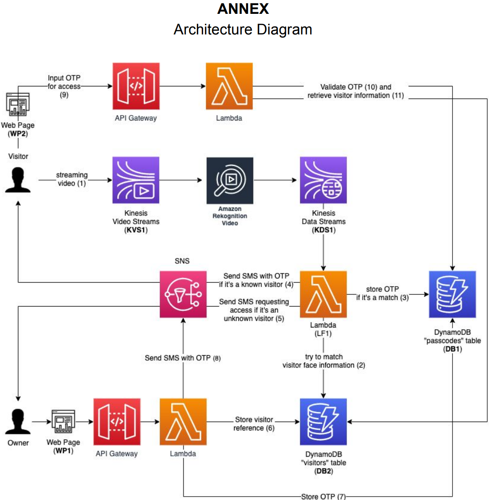

# Smart-Door-Authentication

- Smart Door Authentication is a cloud background project that
    - Live streams the video at the smart door
    - Performs facial recognition analysis to identify faces on the video stream from the smart door
    - Cross-compares with the face in the known visitor library and gets similarity
    - Searches database and determines whether the visitor is a privileged (known) visitor. 
    - If the visitor is a privileged visitor, the system will send a temporary access code via SMS to its reserved mobile phone. Visitor can unlock the door by inputting the code in the web page we offer in the SMS.
    - Otherwise it will record visitor's mobile phone number and send an access request to the owner of the smart door. The owner can see the video stream in a web page and choose whether to grant the visitor access. 
        - If the owner grants the access, the visitor will get a temporary access code via SMS and marked as known visitor in the system.

- AWS services used:
    - **S3** to store known visitors' images and frontend
    - **DynamoDB** to store visitors information and temporary access codes and set TTL
    - **Kinesis Video Stream** to stream video
    - **Rekognition** to perform facial rekognition analysis on the video stream
    - **Kinesis Video Data Stream** to stream rekognition output
    - **SNS** to send One-Time Passcode
    - **Lambda** to trigger and process events
    - **API Gateway**

- See full [Instructions](Instruction.pdf)

- Architecture Diagram

